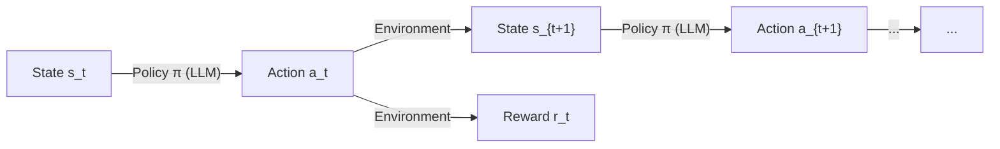

# Step-level MDP

## A Principled Foundation for RL Agent Training

Most existing frameworks treat the LLM agent as a token-level process: the "state" is the ever-growing concatenation of all past tokens, and the "action" is the next token. This token-level view forces context to grow monotonically and makes it hard to apply standard RL algorithms at a meaningful granularity.

Agent-R1 adopts a **step-level MDP** that models the LLM as an agent acting inside an environment:

| MDP Element | Definition |
|---|---|
| **State** \(s_t\) | The prompt presented to the LLM at step \(t\), determined entirely by the environment |
| **Action** \(a_t\) | The LLM's complete response at step \(t\) |
| **Transition** \(T(s_{t+1} \mid s_t, a_t)\) | The environment produces the next observation given the current state and the LLM's response |
| **Reward** \(r_t\) | A per-step reward signal from the environment |
| **Policy** \(\pi(a_t \mid s_t)\) | The LLM itself |

This formulation leads to three key insights:

!!! success "Flexible Context"
    Because the state \(s_t\) is provided by the environment -- not derived by concatenating all prior tokens -- the environment is free to **summarize**, **truncate**, **restructure**, or even **completely replace** the context between steps. As long as the transition function is well-defined, the MDP remains valid.

!!! success "Valid RL Training"
    Each step has its own observation, action, and reward. Log-probabilities are computed conditioned on \(s_t\) independently at each step, so standard policy gradient methods (PPO, GRPO, etc.) apply directly at the step level.

!!! success "Concat as a Special Case"
    The traditional "append everything" approach is simply one particular transition function: \(s_{t+1} = \text{concat}(s_t,\; a_t,\; \text{env}_{output_t})\). It is a valid but by no means the only choice. Agent-R1 supports it as a special case rather than a hard-wired constraint.

## Why It Matters for Agent Tasks

This is the main reason Agent-R1 is built around **multi-step agent behavior** rather than single-step prompting. Once the environment owns the next observation, the framework can naturally support:

- tool calls and structured environment feedback
- state updates across multiple turns
- per-step rewards instead of only outcome rewards
- trajectory-level training for real agent tasks

In practice, this means the important unit in Agent-R1 is not just a token stream, but a sequence of environment-mediated interaction steps.
